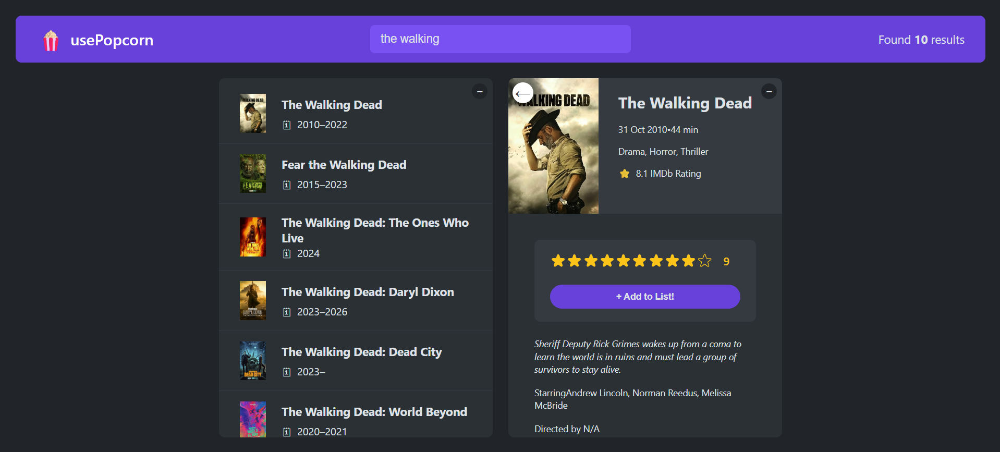

# 🍿 usePopcorn

A React application built as part of my React learning journey. The app allows users to search for movies using the OMDb API, view detailed movie information, rate movies, and create a persistent watchlist.

## ✨ Features

- 🔍 Search movies by title
- 🎬 View detailed information about each movie
- ⭐ Rate movies with a custom star rating component
- 📋 Create and manage a personal watchlist
- 💾 Persist the watchlist using `localStorage`
- 🗑️ Remove movies from the watchlist
- ⌨️ Close movie details with the **Escape** key
- 📱 Responsive layout
- ⚡ Loading and error handling
- 📝 Dynamic document title based on the selected movie

## 🛠️ Built With

- React
- JavaScript (ES6+)
- CSS
- OMDb API
- React Hooks (`useState`, `useEffect`)
- Browser Local Storage

## 📚 What I Learned

This project was created for learning purposes while studying React. During development, I practiced:

- Managing component state with `useState`
- Handling side effects using `useEffect`
- Fetching data from an external API
- Working with asynchronous JavaScript
- Conditional rendering
- Component composition
- Persisting application state with `localStorage`
- Cleanup functions in `useEffect`
- Using `AbortController` to cancel API requests
- Keyboard event handling
- Building reusable React components

## ⚠️ Note

The watchlist is automatically saved in the browser using **localStorage**, so it remains available even after refreshing the page or reopening the application.

## 🚀 Live Demo

https://abolfazl-mohammadi-06.github.io/UsePopcorn/

## 📷 Screenshot

## 🙏 Acknowledgements

This project was built as part of my React learning journey while following **Jonas Schmedtmann's React course**. Movie data is provided by the **OMDb API**.